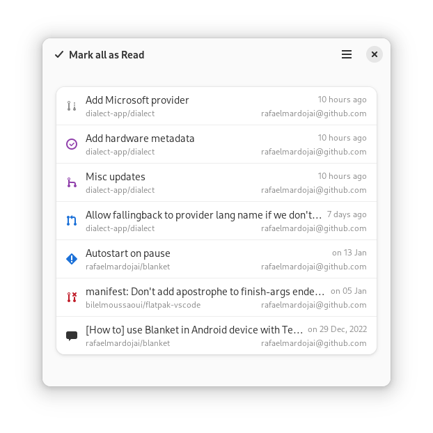

# Forge Sparks

**Get Git forges notifications**

<br>

[](https://circle.gnome.org/)
[](https://stopthemingmy.app)

[](https://github.com/rafaelmardojai/forge-sparks/blob/master/LICENSE)
[](https://paypal.me/RafaelMardojaiCM)
[](https://liberapay.com/rafaelmardojai/donate)

<p align="center">
  
</p>

## Description
Simple notifier app with support for Github, Gitea and Forgejo.

## Install

<a href="https://flathub.org/apps/com.mardojai.ForgeSparks"></a>

### Nightly

Download the latest [Flatpak x86_64 artifact](https://nightly.link/rafaelmardojai/forge-sparks/workflows/CI/main/forge-sparks-devel-x86_64.zip).

### Build from source

You can clone and run from GNOME Builder.

#### Requirements

- GJS (>= 1.72) `gjs`
- GTK4 (>= 4.10) `gtk4`
- libadwaita (>= 1.5.0) `libadwaita`
- libsoup (>= 3.0) `libsoup`
- libsecret (>= 0.20) `libsecret`
- libportal (>= 0.7) `libportal`
- Meson `meson`
- Ninja `ninja`

Alternatively, use the following commands to build it with meson.
```bash
meson builddir --prefix=/usr/local
sudo ninja -C builddir install
```

## Translations
Forge Sparks is translated into several languages. If your language is missing or incomplete, please help to [translate Forge Sparks in Weblate](https://hosted.weblate.org/engage/forge-sparks/).

<a href="https://hosted.weblate.org/engage/forge-sparks/">

</a>

## Credits
Developed by **[Rafael Mardojai CM](https://mardojai.com)** and [contributors](https://github.com/rafaelmardojai/forge-sparks/graphs/contributors).

## Donate
If you want to support my work, you can donate me, [here you can find how](https://mardojai.com/donate/).

## Code of Conduct
The project follows the [GNOME Code of Conduct](https://wiki.gnome.org/Foundation/CodeOfConduct).
